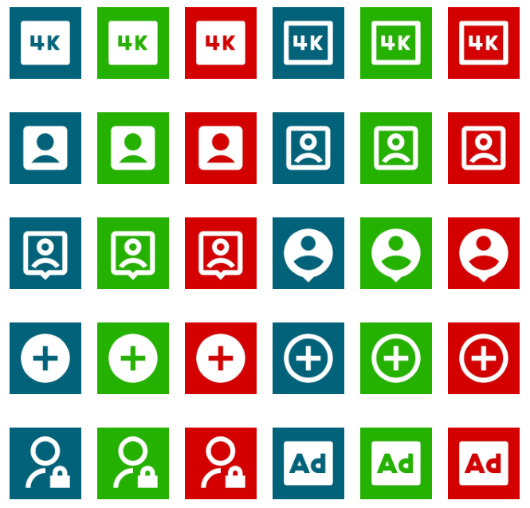

# build-status-icons
Collections of icons in Green, Red and Blue background to indicate the build statuses of Success, Failed and Canceled

## RemixIcon
This repository contains all the icons from [RemixIcons](https://remixicon.com/) converted to PNG.

## Why
Some messagers, like Slack 😡, do not currently suport SVG, any image that will be shared in it must be first converted to a more standard format like PNG or JPG.

## Examples
Here is an screenshot of some of the generated icons, in total there are 6813 images, 3 for each of [RemixIcons](https://remixicon.com/) 2271 icons.

## Usage
Use the following URL to display an image:
`https://github.com/paulogodinho-actions/build-status-icons/blob/main/remixicon-output/{IMAGEID}_{COLOR}.png?raw=true`

- `{IMAGEID}` is a string that can be found in [RemixIcons](https://remixicon.com/), eg. `server-fill`.
- `{COLOR}` is one of the three available colors, `green`, `red` and `blue`

Using the URL:  
`https://github.com/paulogodinho-actions/build-status-icons/blob/main/remixicon-output/server-fill_green.png?raw=true`  
Will output:  

## Thanks
[@rafaelkovaleski](https://github.com/rafaelkovaleski) - README review